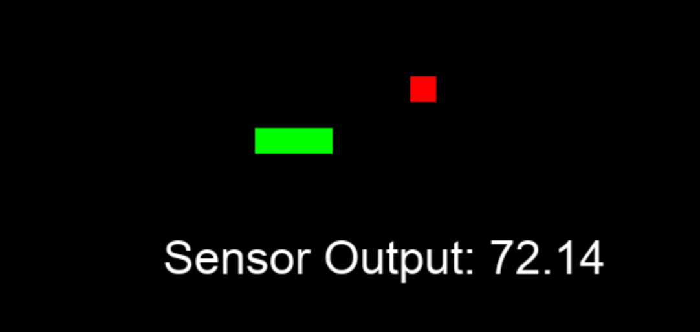

# Petsnake

It's just a game of snake, but the difficulty is correlated to the real-time temperature in my living room. If you log on to play when its 86 degrees F in mmy living room, the game will move 
much faster––and thus be much harder––than if you play when it is 64 degrees F in my living room.   

Real-time data is read through a Kafka consumer reading from a Kafka bootstrap running in a Docker container on a remote Linux server. The data is provided by a DHT11 sensor. 

 
Example frame, where the number shown is the current F Temperature. 

## TODO
[ ] create flask app container hosting game
[ ] host app via VPS
[ ] Research NoIP & ddns